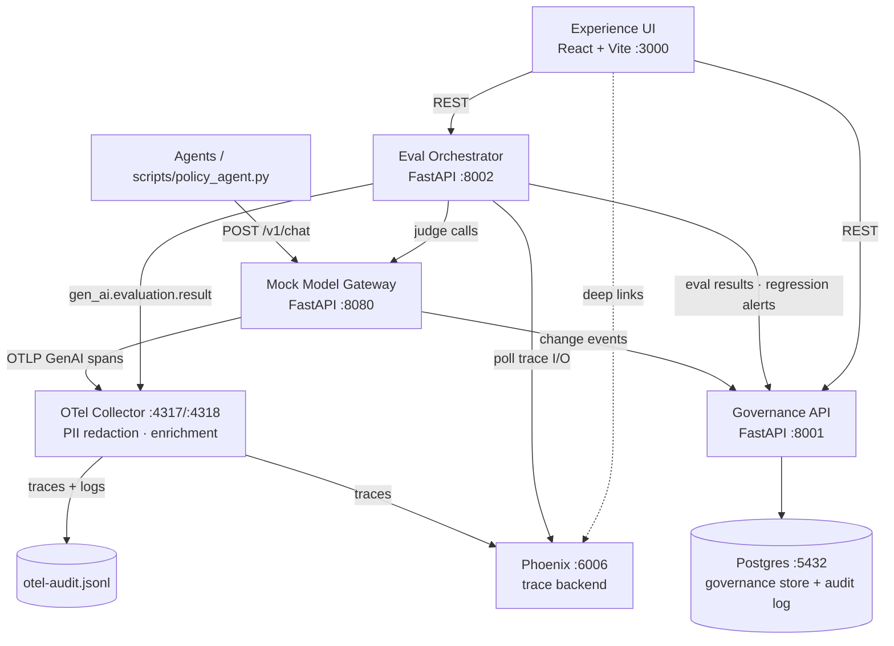

# EvalLib

**Governance for AI agents: every eval, version and verdict, traceable.**

[Live UI (GitHub Pages)](https://chanman22git.github.io/EvalLib/) · [Portfolio](https://chanman22git.github.io/builtbyinstincts/)

> **Note on the live demo:** the Experience UI is published on GitHub Pages at
> <https://chanman22git.github.io/EvalLib/>, but the backend services (governance
> API, eval orchestrator, Phoenix, Postgres) run locally via Docker Compose. The
> hosted UI is therefore not functional on its own right now: it shows a
> "Backend not reachable" banner until those services are running on your machine.
> The full stack can be run locally in a few commands (see
> [Getting started](#getting-started)), and a hosted live demo can be made
> available on request.

## Executive summary

- **Problem:** enterprises run AI agents in production, but gateways, tracers and
  eval frameworks each see only part of the picture. Nobody can easily answer
  "which eval ran on this call, which version, who approved it, and what was the
  verdict?"
- **What it does:** EvalLib is a governance and experience layer that sits
  *above* observability tools such as Phoenix and Datadog. A model call flows
  gateway → trace → eval → OpenTelemetry event → UI, and every verdict carries
  its governance context plus a link back to the trace.
- **Who it's for:** platform/ML engineers (traces and eval results), risk and
  compliance teams (eval approval workflow, audit log), and leadership (pass-rate
  KPIs, regressions).
- **Governance built in:** evals go through a `draft → in_review → approved →
  deprecated` state machine. Approval requires an attached calibration set with
  enough judge/human agreement plus a named approver, and every change lands in
  an append-only audit log.
- **Status:** proof of concept. Single-node, local-first, runs with
  `docker compose`, and works fully offline in mock LLM mode (real Anthropic calls
  are optional).
- **Technical highlights:** six Docker Compose services (FastAPI ×3, Phoenix,
  OpenTelemetry Collector with PII redaction, Postgres), a React + TypeScript UI
  using types generated from the OpenAPI specs, regression detection with ranked
  candidate causes, turn- and session-level (multi-turn) evals, and 67 automated
  tests (61 pytest + 6 Vitest).

## Features

- **Model gateway stand-in** (`mock-gateway`): one chokepoint for all LLM calls,
  including eval judges. It emits OpenTelemetry GenAI spans, stamps `session.id`
  on each turn, and records change events. It uses a mock provider by default and
  switches to Anthropic when `LLM_MODE=anthropic`.
- **Telemetry pipeline:** the OpenTelemetry Collector applies regex-based PII
  redaction (email, SSN, card and phone patterns) and resource enrichment, then
  fans out to Phoenix and a JSONL audit file. Datadog and Splunk exporters are
  stubbed in the config, disabled by default.
- **Governance API:** agent and eval registries, calibration sets, eval-to-agent
  mappings, change events, an eval-results mirror with aggregates, regression
  alerts, and an append-only audit log, backed by Postgres through SQLAlchemy
  and Alembic.
- **Eval governance state machine:** illegal transitions return 400, approval is
  guarded by calibration agreement and approver identity, and approved evals are
  immutable (you create a new version to change one). See
  [`docs/governance-state-machine.md`](docs/governance-state-machine.md).
- **Eval orchestrator:** runs approved, unexpired evals on traces
  (`/run-eval`, `/score`), scores whole conversations (`/score-session`), runs
  sampled-online passes (`/sample-once` plus a background loop) and regression
  detection (`/detect-regressions`). Suite scoring supports blocking evals, where
  one blocking failure fails the suite. Results are dual-written: as an OTel
  `gen_ai.evaluation.result` event and to the Postgres mirror.
- **Experience UI:** Dashboard (KPIs, pass-rate trend, recent regressions and
  changes), Agents, Evals (with governance actions), Conversations, Traces
  (with "Open in Phoenix" deep links), Regressions, Changes and Governance (audit
  log) views.
- **Retrieval-grounded policy agent:** a CLI agent (`scripts/policy_agent.py`)
  answers questions from a real refund-policy document in `kb/`, routes every
  turn through the gateway and auto-runs its mapped eval. The agent and the judge
  retrieve from the same document.
- **Seed data and demo loop:** sample agents, evals (turn- and session-scoped)
  and calibration sets, synthetic traces, and an injected regression for the
  demo.

## Architecture



Key design decisions (full detail in [`docs/architecture.md`](docs/architecture.md)):

- **Phoenix is the trace store and eval engine.** Postgres holds only
  enterprise governance data, never duplicated traces.
- **All LLM calls, including eval judges, go through the gateway**, so it stays
  the single observable chokepoint.
- **The orchestrator polls Phoenix** for trace I/O instead of running a second
  OTLP receiver. The OTel event and the Postgres mirror are authoritative.
- **Evals carry a `scope`** (`turn` or `session`). Session-scoped evals score a
  transcript built from every turn in a conversation.
- **The UI consumes TypeScript types generated from the backend OpenAPI specs**
  (`npm run gen:types`).

## Tech stack

| Layer | Technology |
|---|---|
| Backend services | Python 3.11, FastAPI, Pydantic, httpx, Uvicorn |
| Evals | `arize-phoenix-evals`, Anthropic SDK (optional; mock mode by default) |
| Telemetry | OpenTelemetry SDK + OTLP exporters, OpenTelemetry Collector (contrib) |
| Trace backend | Arize Phoenix (self-hosted container) |
| Governance store | Postgres 15, SQLAlchemy, Alembic |
| Frontend | React 18, Vite 6, TypeScript, Tailwind CSS, shadcn/Radix UI, TanStack Query, Recharts |
| Testing | pytest, Vitest + Testing Library |
| Infra | Docker Compose, Makefile, GitHub Actions (UI to GitHub Pages) |

## Project structure

```
EvalLib/
├── docker-compose.yml          # postgres, phoenix, otel-collector, mock-gateway,
│                               # governance-api, eval-orchestrator, ui, seed (tools profile)
├── Makefile                    # developer entrypoints (make help)
├── .env.example                # all configuration; copy to .env
├── docs/                       # architecture, OTel conventions, state machine,
│                               # demo script, acceptance criteria
├── kb/refund_policy.md         # policy document used by the grounded agent + judge
├── otel-collector/             # collector config (PII redaction, fan-out)
├── scripts/
│   ├── demo.sh                 # end-to-end demo
│   ├── policy_agent.py         # retrieval-grounded CLI agent (stdlib only)
│   └── reset.sh, load-otel-data.sh
├── services/
│   ├── mock-gateway/           # FastAPI gateway; providers/{mock,anthropic}
│   ├── governance-api/         # FastAPI + SQLAlchemy; routers/, state_machine.py, alembic/
│   ├── eval-orchestrator/      # executor, samplers, suite, regression job, retrieval
│   ├── seed/                   # seed_data.py, sample_traces.py, sample_evals/*.yaml
│   └── ui/                     # React app: pages/, components/, api/*.gen.ts
└── .github/workflows/pages.yml # builds services/ui and deploys to GitHub Pages
```

Each service has its own `README.md` with service-specific detail.

## Getting started

### Prerequisites

- Docker with Docker Compose v2
- `make`
- Python 3 on the host, only for the `make chat` policy agent (it uses the
  standard library only)
- Optional: an Anthropic API key for real LLM calls

### Run the stack

```bash
make setup     # creates .env from .env.example and the collector output dir
make up        # builds images and starts the stack (alias: make run)
make seed      # populates the governance store with demo data
make demo      # optional: end-to-end demo (scripts/demo.sh)
```

Once it's up:

| Service | URL |
|---|---|
| Experience UI | http://localhost:3000 |
| Phoenix | http://localhost:6006 |
| Governance API docs | http://localhost:8001/docs |
| Eval Orchestrator docs | http://localhost:8002/docs |
| Mock Gateway docs | http://localhost:8080/docs |

With the stack running locally you can also use the hosted UI at
<https://chanman22git.github.io/EvalLib/>. Its build points at
`http://localhost:8001`, `:8002` and `:6006`, and the services allow
cross-origin requests.

Other targets: `make down`, `make reset` (also deletes data volumes), `make logs`,
`make ps`, `make build`. Run `make help` for the full list.

### Environment variables

All configuration lives in `.env` (git-ignored), created from
[`.env.example`](.env.example). The defaults work as-is in mock mode. The main
settings are:

| Variable | Purpose |
|---|---|
| `LLM_MODE` | `mock` (default, no network calls) or `anthropic` |
| `ANTHROPIC_API_KEY`, `ANTHROPIC_BASE_URL` | Required only when `LLM_MODE=anthropic` |
| `ANTHROPIC_MODEL` | Real model id used for all anthropic-mode calls (agent + judges) |
| `GATEWAY_DEFAULT_MODEL`, `JUDGE_DEFAULT_MODEL` | Placeholder model names recorded on spans |
| `OTEL_EXPORTER_OTLP_ENDPOINT`, `DEPLOYMENT_ENVIRONMENT`, `SERVICE_NAMESPACE` | Telemetry export and resource attributes |
| `OTEL_INSTRUMENTATION_GENAI_CAPTURE_MESSAGE_CONTENT` | Capture prompt/response content as span events |
| `PHOENIX_IMAGE`, `PHOENIX_OTLP_ENDPOINT`, `PHOENIX_BASE_URL` | Phoenix image and endpoints |
| `POSTGRES_*`, `DATABASE_URL` | Governance store connection (local dev credentials) |
| `GOVERNANCE_API_URL`, `EVAL_ORCHESTRATOR_URL`, `GATEWAY_URL` | Intra-cluster service URLs |
| `VITE_GOVERNANCE_API_URL`, `VITE_ORCHESTRATOR_URL`, `VITE_PHOENIX_URL` | Browser-facing URLs baked into the UI build |

To use real models, set `LLM_MODE=anthropic`, `ANTHROPIC_API_KEY` and
`ANTHROPIC_MODEL` in `.env`, then run `make up` again.

### Send a call through the gateway

```bash
curl -s localhost:8080/v1/chat -H 'content-type: application/json' -d '{
  "messages": [{"role":"user","content":"What is your refund policy?"}],
  "agent": {"agent_id":"agent-support-refund","framework":"langgraph",
            "criticality":"critical","data_classification":"restricted",
            "business_unit":"retail-banking"}
}' | jq .
```

The trace appears in Phoenix (http://localhost:6006) within a couple of seconds.
Raw, redacted telemetry is written to `otel-collector/output/otel-audit.jsonl`.

### Talk to the grounded policy agent

```bash
make up && make seed
make chat                  # interactive REPL
# or one-shot:
python3 scripts/policy_agent.py -q "Can I get a refund 25 days after purchase?"
```

Each turn prints the grounded answer, the trace id, the eval verdict, and links to
Phoenix and the EvalLib trace page. In mock mode the answer quotes the retrieved
policy and the verdict is deterministic but arbitrary. Set `LLM_MODE=anthropic`
for real answers and meaningful verdicts.

## Testing

Backend tests run inside the service containers:

```bash
make test                  # governance-api + eval-orchestrator suites
make test-governance       # governance-api only
make test-orchestrator     # eval-orchestrator only
docker compose run --rm mock-gateway pytest -q   # mock-gateway suite
```

UI tests use Vitest:

```bash
cd services/ui
npm ci
npm test
```

| Suite | Tests | Covers |
|---|---|---|
| governance-api | 22 | agent CRUD, eval state machine and approval guards, resource endpoints |
| eval-orchestrator | 33 | executor, suite scoring (incl. blocking + scope), regression detector/job, retrieval, API |
| mock-gateway | 6 | chat endpoint (mock provider, judge verdicts, grounded answers), validation, change events |
| UI (Vitest) | 6 | eval governance actions, conversation grouping |

[`docs/acceptance-criteria.md`](docs/acceptance-criteria.md) walks through the
acceptance criteria (AC-1 to AC-14) with evidence.

## Deployment

- **Backend:** local only, via Docker Compose. There is no hosted backend.
- **UI:** `.github/workflows/pages.yml` builds `services/ui` with
  `VITE_BASE=/EvalLib/` and deploys it to GitHub Pages on pushes to `main` that
  touch `services/ui/**`. The Vite build copies `index.html` to `404.html` so
  client-side routes work on Pages.
- **Anthropic mode:** optional, configured entirely through `.env`.

## Documentation

| Doc | What's in it |
|---|---|
| [`docs/architecture.md`](docs/architecture.md) | Components, key decisions, data flow, ports |
| [`docs/otel-conventions.md`](docs/otel-conventions.md) | Every OTel attribute emitted, and why (GenAI semconv) |
| [`docs/governance-state-machine.md`](docs/governance-state-machine.md) | Eval lifecycle, approval guards, audit trail |
| [`docs/demo-script.md`](docs/demo-script.md) | Five-minute walkthrough for engineering, risk and leadership |
| [`docs/acceptance-criteria.md`](docs/acceptance-criteria.md) | Acceptance criteria status with evidence |

## Roadmap and known limitations

- **Experimental POC, not deployed to production.** The services intentionally
  have no authentication and use permissive CORS (`allow_origins=["*"]`) for
  local development. Authentication would be added before any shared deployment.
- **Hosted demo:** only the UI is hosted. A hosted backend for a live demo can be
  made available on request.
- **Single node:** no multi-tenant isolation or production-scale, multi-node
  deployment.
- **Inline gateway enforcement is scaffolded only.** `POST /inline-eval` returns
  501; evals run offline or on sampled traffic, not as a synchronous gate.
- **PII redaction is regex-based** and POC-grade.
- **Mock mode verdicts are arbitrary.** Meaningful verdicts need
  `LLM_MODE=anthropic`.
- Out of scope for this POC: self-healing remediation, judge panels, and formal
  regulatory certification (for example SR 11-7 or the EU AI Act).

## Secrets

All secrets live in `.env`, which is git-ignored. Never commit real keys. The
Postgres credentials in `.env.example` are local development defaults.

## Author

Built by **Chandru** ([BuiltByInstincts](https://chanman22git.github.io/builtbyinstincts/)),
Product & Data Builder in Bengaluru.
[LinkedIn](https://linkedin.com/in/chandrasekarv22)
